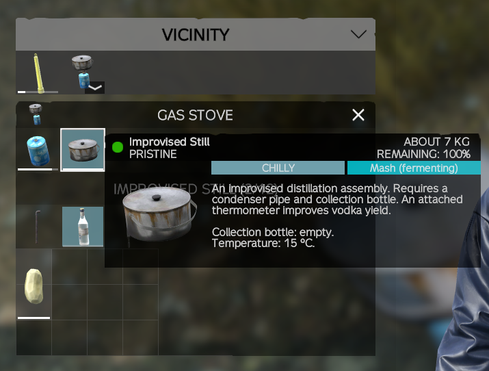

# Improvised Still (DayZ mod)

Author: Capn_Crusty

Craft a still from a cooking pot and a pipe, then distill any water into clean drinking water, or fruit and potatoes into moonshine, over a fire or a gas stove. Works on vanilla DayZ with no other mods required.

## How to use
1. **Craft:** combine a cooking pot with a pipe, either way round (in hands, in inventory or on the ground). The still lands in your hands with the pipe in its Condenser Pipe slot. It keeps the pot's condition and the pipe's condition.
2. **Bottle:** attach a glass bottle, plastic water bottle, water pouch or filtering bottle to the Collection Bottle slot (canteens do not fit). Optionally attach a **thermometer** to the Thermometer slot: while attached it adds 25% to the moonshine yield, and the still's tooltip shows its temperature.
3. **Heat:** put the still on a lit fireplace or fire barrel, or on a lit portable gas stove. It only runs while heated with both the pipe and the bottle attached.
4. **Load:**
   - **Clean water:** fill the still with any water: sea, pond, river or snow. Any water container (bottles, canteens, pots, cauldrons, jerry cans, the still) can be filled straight from the sea.
   - **Moonshine:** fill the still with fresh water (salt water will not ferment) and put fruit or potatoes in its cargo, then leave it **unheated** to ferment (15 minutes by default; the tooltip shows "MASH (FERMENTING)", then "MASH (READY)"). Heat pauses fermentation, and heating early just distills clean water. Once ready, heat it: each item makes 100 ml of moonshine per inventory slot it takes up, then it is used up. Dried and cooked fruit work like fresh; rotten fruit gives half the moonshine and the batch is more likely to go bad; burnt or ruined fruit does not ferment; a partly eaten item gives its share. Berries and pumpkin count as fruit; tomatoes, peppers and zucchini give a quarter of the moonshine; cannabis does not ferment. Fermenting is full speed from 20 °C, slower in the cold, and stops at 5 °C or below and above 40 °C (hot mash must cool first); the tooltip shows "MASH (TOO COLD)" or "MASH (TOO HOT)". Adding fruit to ready mash sends it back to fermenting for half the usual time; adding it while fermenting just joins the batch. Ready mash left unheated for 2 hours (longer in the cold) spoils ("MASH (SPOILED)"): its fruit rots, it distills only to clean water, and drinking it can give food poisoning. Fermentation progress survives server restarts.
   - **Heating up:** nothing comes over until the liquid is hot enough: moonshine from 78 °C (alcohol's boiling point), clean water at 100 °C. A thermometer attachment shows the temperature.
5. **Output:** every 30 seconds up to 50 ml moves into the bottle. The still's tooltip shows the collection bottle's contents and fill level (and a missing pipe or bottle), which helps when it sits on a fireplace where its slots are not shown. The still pauses if the bottle is full or already holds a different liquid. Plastic water bottles take a little damage with each batch.

## Liquids
- **Salt Water** shows its name in the item tooltip (you would taste it at once). **Clean Water** shows as plain "Water": distilled water looks like any other, so only the still's tooltip (its collection bottle line) names it. Keep track of which bottles you filled.
- **Clean Water** is safe drinking water, the same as vanilla Water. Distilling strips all disease, so it is more reliable than boiling. It also works as car radiator coolant (salt water and mash do not).
- **Salt Water** dehydrates you (each ml costs about 1.5 ml of hydration), makes you vomit once about 500 ml is in your stomach, and causes **saltwater sickness** after about 300 ml: cholera-like vomiting and water loss, worse the more you drink. Antibiotics do not cure it; a completed saline IV (the whole bag, on yourself or another player) does. Real cholera is unchanged and still needs tetracycline.

## Mash
Drinking from a still holding ready mash counts as beer (hydration and energy). Each batch has a chance (20% by default) to go bad when it becomes ready; drinking a bad batch can give food poisoning.

## Drinking
Moonshine and beer (including ready mash) make you drunk as your stomach absorbs them; food in the stomach slows it down. The level wears off over time and is saved with your character, so logging out does not sober you up.

| Level | About (empty stomach) | Effects |
|---|---|---|
| Tipsy | 50 ml of moonshine | Mild pulsing blur, a warm feeling (heat buffer rises), extra water loss |
| Drunk | 150 ml | Strong blur, the occasional stumble, pain relief (vanilla painkiller effect) |
| Very drunk | 300 ml | Heavier blur and stumbles, a chance to vomit |
| Blackout | 500 ml | You pass out until shock recovers |

**Blackout warning:** passing out is vanilla unconsciousness. If you disconnect, quit or your game crashes while blacked out, vanilla kills your character (its anti-combat-log rule). A clean server restart is safe.

## Cooking
The still cooks food like a normal pot. While it holds liquid, boiled food stays boiled and does not burn; once it runs dry, food can bake and burn as in any pot.

## Moonshine as disinfectant
Moonshine in a drink container works like alcohol tincture, 25 ml per use:
- Disinfect yourself or another player.
- Disinfect items (rags, clothing, tools) by combining them with the bottle.
- Wash bloody hands.

## Server setup
Copy the key from `keys` to your server's keys folder, and add `improvisedstill_types.xml` (in the mod folder) to your mission: put it in a CE folder registered in `cfgeconomycore.xml` (e.g. `<ce folder="customtypes"><file name="improvisedstill_types.xml" type="types" /></ce>`), or copy its entry into `db/types.xml`. The still is crafted only (never spawns as loot); the entry sets how long an untouched still lasts before cleanup (7 days by default).

## Server settings
On first start the server creates `<server profile>/ImprovisedStill/config.json` with the defaults below. Edit it and restart the server to apply changes; missing keys keep their defaults.

| Setting | Default | Meaning |
|---|---|---|
| `SpiritName` | Moonshine | What players see the spirit called (it is vanilla's vodka liquid underneath; the settings below keep "Vodka" in their names) |
| `SaltwaterSicknessStartAgents` | 100 | Agents at which saltwater sickness starts |
| `SaltwaterSicknessEndAgents` | 20 | Agents at which it ends |
| `SaltwaterAgentsPerMl` | 0.35 | Agents taken in per ml of salt water digested |
| `SaltwaterAgentGrowth` | 0.3 | How fast agents multiply (vanilla cholera 0.15) |
| `SaltwaterAgentDieOff` | 0.2 | Agents lost per second when the immune system wins (vanilla cholera 0.45) |
| `SaltwaterVomitStomachMl` | 500 | Salt water in the stomach that causes vomiting; 0 disables |
| `SaltwaterHydrationLossPerMl` | 1.5 | Hydration lost per ml of salt water digested |
| `SalineResistanceSeconds` | 0 | Immunity to saltwater sickness after a completed saline IV; 0 disables |
| `FermentationMinutes` | 15 | Unheated time a mash needs before it distills to moonshine; 0 = instant |
| `MashFoodPoisonChance` | 0.2 | Chance (0-1) a batch goes bad when it becomes ready |
| `RottenMashFoodPoisonChance` | 0.6 | The same chance when any of the fruit or potatoes are rotten (burnt ones do not ferment) |
| `LowSugarVegetableVodkaYield` | 0.25 | Moonshine from tomatoes, peppers and zucchini compared with fruit |
| `SpiritPerCargoSlot` | 100 | ml of moonshine per inventory slot the fruit or potato takes up |
| `MashWaterPerSpiritMl` | 1 | ml of mash water used up per ml of moonshine (realistically 5-10) |
| `TopUpFermentationFraction` | 0.5 | Fruit added to ready mash sends it back to fermenting for this share of `FermentationMinutes`; 0 = stays ready |
| `FermentMinTemperature` | 5 | Liquid temperature (°C) at or below which fermentation and spoiling stop |
| `FermentFullSpeedTemperature` | 20 | Full fermentation speed from this temperature; slower below it |
| `FermentMaxTemperature` | 40 | Above this (hot mash after heating) fermentation stops until it cools |
| `MashSpoilMinutes` | 120 | Unheated time ready mash keeps before it spoils; 0 = never |
| `MashDistillTemperature` | 78 | Liquid temperature (°C) at which ready mash starts giving moonshine; water distills at 100 °C |
| `RottenFruitVodkaYield` | 0.5 | Moonshine from rotten fruit or potatoes compared with fresh, dried or cooked |
| `ThermometerVodkaBonus` | 0.25 | Extra moonshine while a thermometer is attached (0.25 = +25%) |
| `VodkaAlcoholPerMl` | 1.0 | Intoxication units per ml of moonshine digested |
| `BeerAlcoholPerMl` | 0.1 | Units per ml of beer (and ready mash) |
| `TipsyUnits` / `DrunkUnits` / `VeryDrunkUnits` | 50 / 150 / 300 | Thresholds for each level |
| `BlackoutUnits` | 500 | Passing out; 0 disables |
| `SoberingUnitsPerMinute` | 15 | How fast it wears off |
| `AlcoholWaterLossPerUnit` | 0.01 | Extra water lost per second, per unit |
| `VeryDrunkVomitChance` | 0.075 | Vomit chance per 3 s while very drunk |
| `PainReliefFromTier` | 2 | Painkiller effect from this level up (1 tipsy, 2 drunk, 3 very drunk); 0 disables |
| `AlcoholWarmthPerSecond` | 0.02 | Heat buffer gained per second while tipsy or more; 0 disables |

## Planned
- A dedicated still model built from vanilla parts (cooking pot body, the attached pipe and bottle shown in place).

## Layout
- `Data/` item, slot and liquid config (Data.pbo, prefix `ImprovisedStill/Data`)
- `Scripts/` Enforce Script (Scripts.pbo, prefix `ImprovisedStill\Scripts`): `4_World` gameplay, `5_Mission` tooltip names

## Releases
Steam Workshop: https://steamcommunity.com/sharedfiles/filedetails/?id=3813055823

## License
See [LICENSE](LICENSE). Requires DayZ; not affiliated with or endorsed by Bohemia Interactive.
